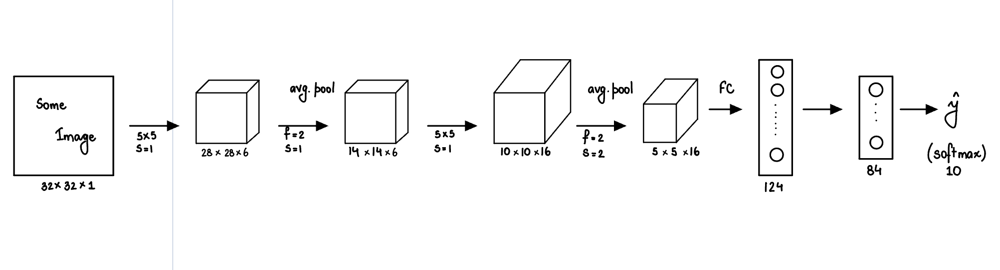
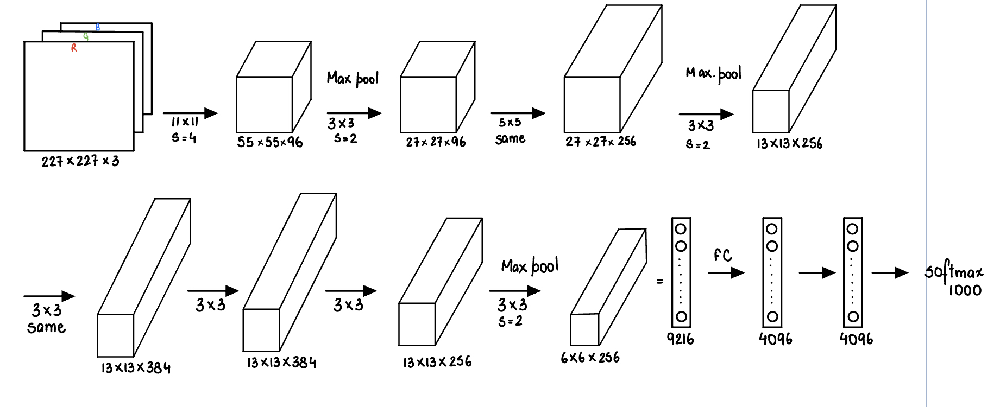
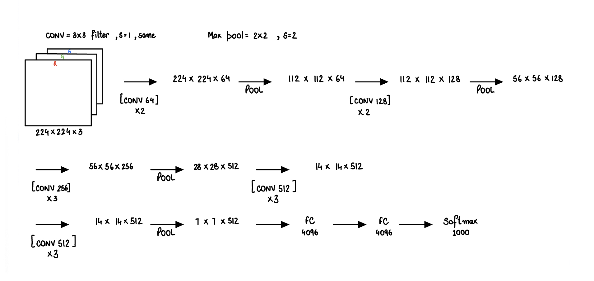
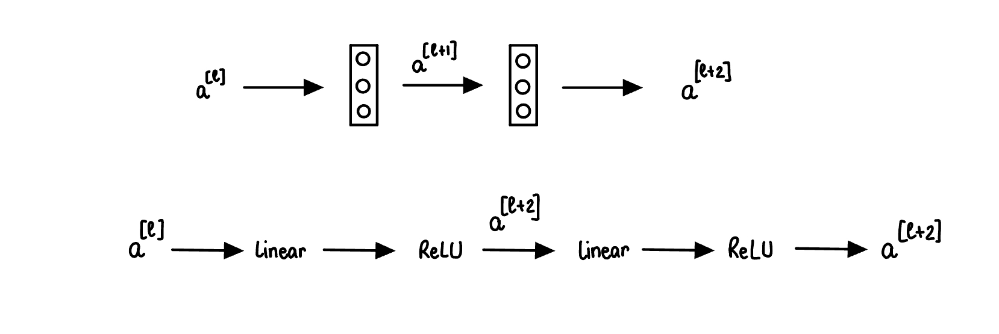
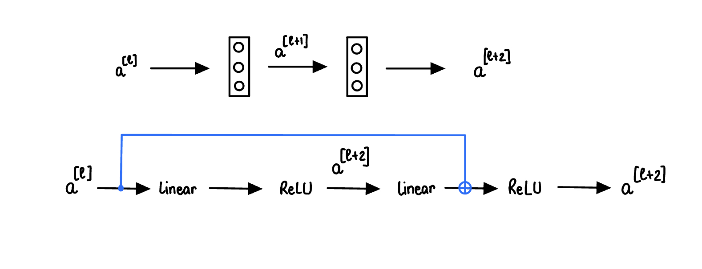
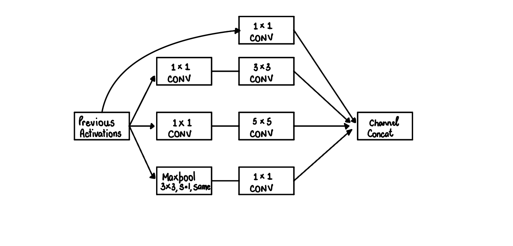
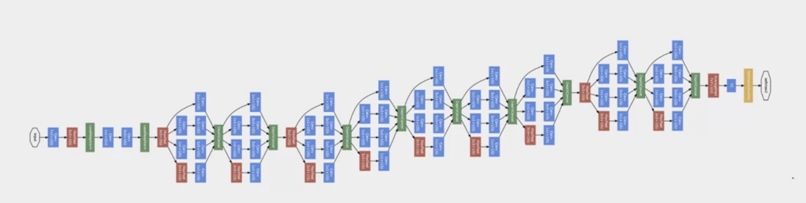

# Deep Convolutional Models: Case Studies

We will go over some of the classic neural network architecture starting with LeNet-5, AlexNet, and VGGNet. Let's take a look at the LeNet-5 architecture.  

## LeNet-5

The main reason behind the popularity of this model was its simple and straightforward architecture. It is a multi-layer convolution neural network for image classification.

This was all about Lenet-5 architecture. Finally, to summarize The network has 5 layers with learnable parameters.

The input to the model is a grayscale image.

It has 3 convolution layers, two average pooling layers, and two fully connected layers with a softmax classifier.

The number of trainable parameters is 60000.

## AlexNet

## VGGNet

## ResNets

ResNets are build out of something called Residual Block. Here is a original flow of information from $a^{[l]}$ to $a^{[l+2]}$.

In Residual Net, we are going to take the $a^{[l]}$ and fast forward it, match it further into the neural network like: 

Instead of $a^{[l+2]} = g(z^{[l+2]})$, we will have $a^{[l+2]} = g(z^{[l+2]} + a^{[l]})$. The addition of the extra term makes it the residual block.

The picture below respresents 5 residual Blocks stacked together and this a residual network. With a plain NN, the training error (in practice) starts to increase after a certain number of layers, but a ResNet's training error keep going down with number of layers increase. This helps us to train much deeper neural networks without really appreciable loss in performance.

## Network in Network and 1x1 Convolutions 

We know that we can use pooling layer to shrink the size of $n_H$ and $n_W$, the height and width of the volumes. This idea of one-by-one convolutions allows to shrink the number of channels, $n_C$ and therefore save on computation in some networks. Suppose we have an image of size 28x28x192. If we apply 32 1x1 convolutions to it, then we will shrink the size of the image to 28x28x32.

## Inception Network

When we are building a layer of a neural network and we don't want to have to decide if we want a 1x1, or 3x3, or 5x5, or pooling layer, the inception module lets us do them all, and concatenate the results. But, then we run into the problem of computational cost. We can create a bottleneck layer inbetween, which reduces the computational cost significantly. 
Does shrinking down the representation size so dramatically hurt the performance of the neural network? It turns out that so long as we implement this bottleneck layer within reason, we can shrink down the representation size significantly, and it doesn't seem to hurt the performance, but saves a lot of computation. 

Take the below as an example, where we are starting with some previous layer activation,  applying inception, and concatenating all the chanenls together. Inception Module puts all of these modules together.

This a picture of the inception network, taken from the paper by Szegedy et al. We notice a lot of repeated blocks (inception) in it.

## MobileNet

The NN that we discussed so far are quiet computationally expensive. Using MobileNets allows us to build and deploy new networks that work even in low compute environment, such as a mobile phone. 