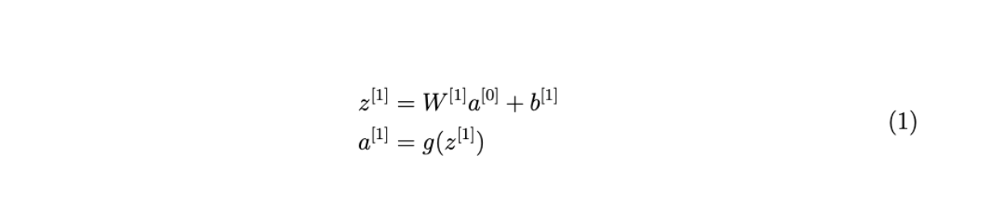

# Convolveutional Neural Networks

## Computer Vision Edge Detection

In computer vision, we need to find out the edges in pictures to classify different objects and "detect objects" as we say. We simply convolve the image by a 3 x 3 matrix to get a new image which shows the edges more clearly. We can obtain multiple new pictures like this from the original picture to detect the edges. Some of the well know filter matrices are Sobel filter, Scharr filter, etc. 

There can be times we do not have to hand pick the 9 numbers in the matrix, rather we can use them as parameters and learn the optimal value of those using back prop.

The rule of convolveing the image is as follows: If the image is a nxn matrix, and the matrix  convolveving matrix is fxf, then the dimension of the output will be a matrix of (n+f-1, n+f-1). There are two downsides to this: 

1. Every time we apply a convolveutional operator, the image shrinks. So after a short while, we will be left with an image which is really small, maybe it **shrinks down** to one by one matrix. We don't want our image to shrink every time we detect edges or to set other features on it. 
2. Second downside is that, if we look the pixel at the corner or the edge, that pixel is only in one of the outputs, because this touches the three adajcent regions in comparision to a pixel in the middle of the picture. Thus we are **throwing some useful information** in this process.

To solve this, we can use **Padding**, which means adding some extra dimensions on the original picture. Using this, we will have able to preserve the original size of the picture. We can pad the original image with zeros, and we will denote the padding amount as p. The newer dimension of the original image becomes (n+2p-f+1, n+2p-f+1).

## Strided Convolutions

This basically is a convolveuational method but we are moving jumping the rows and columns by 2 instead of 1. Then it is called a **Stride = 2**. The input and output dimensions are governed by the following formula: If we have an (n, n) image and a (f, f) filter and we use padding p, stride s, we end up with a output of dimension ((n+2p-f)/s + 1 x (n+2p-f)/s + 1)). If we end up with a fractical dimensional in the output, not an integer, then we will use the floor operation to get an integer dimension of the output image.

## Convolutions Over Volume

Until now, we were talking about convolveution in a 2D images. If we are using RGB images, then we know that we have 3 layers of colors in that image. How will we convolve on these layers of images. The dimensions of the input image becomes 3 here. The dimension of the output image remains the 2 dimensionsal. The process is exactly the same in the 3 dimensional case. We will convolveve using the 3D over the input image. In this case, we will have 27 numbers to multiple to get the (1,1) output color of the output image.

If we want to detect multiple edges, we will use multiple filters. The second output image will become the second layer of the first output image. We are going to use **channels** to denote the layers in the output image.

## One Layer of a Convolutional Network

One layer of forward propagation of standard Neural Network is as follows: 
